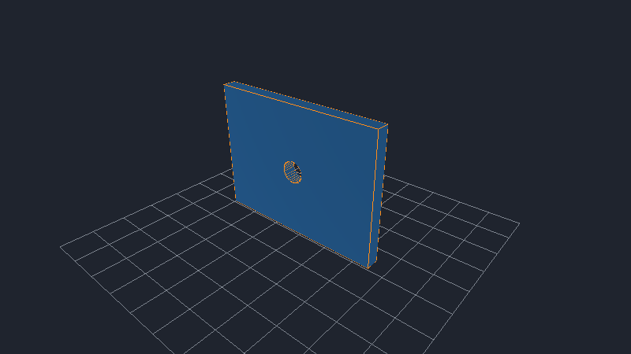
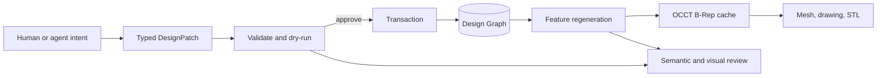

<p align="center">
  
</p>

<h1 align="center">MusubiCAD</h1>

<p align="center">
  <strong>CAD changes you can review like code.</strong>
</p>

<p align="center">
  MusubiCAD is an AI-native, open-source parametric 3D CAD system built on a
  deterministic Design Graph. Agents propose typed patches, MusubiCAD regenerates
  and verifies the geometry, and humans decide whether to apply the change.
</p>

<p align="center">
  <a href="#try-a-real-design-review"><strong>Try the review workflow</strong></a>
  ·
  <a href="docs/architecture/overview.md">Architecture</a>
  ·
  <a href="docs/api/agent.md">Agent API</a>
</p>

<p align="center">
  <a href="https://github.com/rsasaki0109/MusubiCAD/actions/workflows/ci.yml"></a>
  <a href="https://github.com/rsasaki0109/MusubiCAD/stargazers"></a>
  
  
</p>

<p align="center">
  
</p>

<p align="center">
  <sub>
    A real DesignPatch changes the bracket width from 80 mm to 100 mm.
    MusubiCAD dry-runs the patch, regenerates both models with OCCT, and checks the expected effects without mutating the original document.
  </sub>
</p>

## The workflow

| 1. Agent proposes | 2. MusubiCAD verifies | 3. Human approves |
|---|---|---|
| Typed `DesignPatch` | Transactional dry-run | Before/after geometry |
| Intent and rationale | OCCT regeneration | Semantic diff |
| Explicit units | Expected-effect checks | Apply or reject |

AI changes never bypass validation. A failed regeneration never corrupts the document,
and cached B-Rep shapes and meshes remain disposable outputs of the Design Graph.

## Why MusubiCAD?

| Typical binary CAD workflow | MusubiCAD workflow |
|---|---|
| Review an opaque file or screenshot | Review intent, parameters, geometry, and engineering effects |
| Automation mutates application state | Agents submit serializable `DesignPatch` proposals |
| Cached geometry can become implicit state | The deterministic Design Graph is the source of truth |
| Failures may be discovered after editing | Patches can be dry-run and rejected before mutation |
| Diffs stop at file-level changes | Semantic diff reports values such as `80 mm → 100 mm` |

The goal is not to let an LLM silently manufacture geometry. The goal is to give
humans and agents the same inspectable, testable model-editing protocol.

## Try a real design review

You need [stable Rust](https://www.rust-lang.org/tools/install). The first build
downloads a prebuilt OpenCASCADE 8.0 binary automatically; no system OCCT install is
required.

```bash
git clone https://github.com/rsasaki0109/MusubiCAD.git
cd MusubiCAD
cargo run -p opencad-cli -- review \
  examples/bracket.ocad.d \
  examples/agent/review_width_patch.json \
  --output review
```

The command produces a self-contained review bundle:

```text
review: review/review.html
document: doc:bracket_001
changes: 2
```

Open `review/review.html` to inspect:

- width: **80 mm → 100 mm**
- mass: **76.50 g → 84.10 g**
- regenerated before/after geometry
- the patch intent and rationale
- two checked expected effects

The source document is unchanged. The checked-in
[`review_width_patch.json`](examples/agent/review_width_patch.json) contains the
proposal, preconditions, and expected engineering effects.

## How it works



The boundaries are deliberate:

- `modules/graph` owns design intent and dependency analysis, not kernel calls.
- `modules/feature` executes features only through the kernel-neutral `GeometryKernel`.
- `modules/kernel-occt` contains concrete OCCT integration.
- `modules/ai` orchestrates validated patches and never mutates outside transactions.
- `modules/render` consumes disposable tessellation and never owns the Design Graph.

Read the [architecture overview](docs/architecture/overview.md) and
[Design Graph documentation](docs/architecture/design-graph.md) for details.

## What works today

- **Parametric modeling:** constrained sketches, extrude, hole, revolve, fillet, and chamfer
- **Patterns:** linear, circular, and mirror patterns with union and cut operations
- **Semantic topology:** stable face references with fingerprint fallback across regeneration
- **Assemblies and drawings:** instances, connectors, mates, orthographic SVG, hidden lines, and model-driven dimensions
- **Agent API:** JSON-RPC query, explain, patch, diff, dry-run, regenerate, pick, and export operations
- **Git-native review:** deterministic JSON/HTML/GIF artifacts, policy checks, patch rebase, and three-way semantic merge
- **Headless output:** PNG/GIF rendering plus STL and SVG export

Every command exposed by the desktop UI is also available through the CLI or Agent
API. See the [Agent API reference](docs/api/agent.md) and
[Git-native workflow](docs/architecture/git-native-workflow.md).

## Desktop preview

<p align="center">
  
</p>

The Tauri desktop shell can open `.ocad.d` documents, regenerate previews, edit
parameters through backend commands, undo and redo edits, pick faces and sketch
entities, and open an interactive wgpu viewport.

```bash
cd apps/desktop/src-tauri
cargo install tauri-cli --version "^2.0.0"
cargo tauri dev
```

See the [desktop guide](apps/desktop/README.md) for platform prerequisites.

## Examples

| Example | Demonstrates |
|---|---|
| [`bracket.ocad.d`](examples/bracket.ocad.d) | Plate, centered hole, and semantic face reference |
| [`bracket_hole_row.ocad.d`](examples/bracket_hole_row.ocad.d) | Parametric linear cut pattern |
| [`bracket_pin_mirror.ocad.d`](examples/bracket_pin_mirror.ocad.d) | Mirror pattern driven by a semantic plane reference |
| [`revolve_bushing.ocad.d`](examples/revolve_bushing.ocad.d) | Revolved annular solid |
| [`assembly_two_brackets.ocad.d`](examples/assembly_two_brackets.ocad.d) | Components, placements, connectors, and mates |
| [`bracket_front_view.ocad.d`](examples/bracket_front_view.ocad.d) | Orthographic drawing with an explicit 80 mm dimension |
| [`examples/agent/`](examples/agent) | Ready-to-run JSON-RPC and DesignPatch requests |

More examples and commands are listed in [`examples/README.md`](examples/README.md).

## Project status

MusubiCAD is an early-stage engineering project, not yet a production CAD replacement.
The Design Graph, `.ocad` format, geometry pipeline, and Agent API are functional and
covered by deterministic tests, but APIs and schemas may evolve before 1.0.

Current priorities:

1. GitHub-native CAD review summaries
2. Reproducible README demo generation
3. A one-command, 60-second first-run experience
4. Downloadable desktop builds

## Contributing

Contributions are welcome in geometry, constraints, rendering, file formats, agent
workflows, documentation, and test fixtures. Start with the
[developer guide](docs/developer-guide/index.md) and read [`AGENTS.md`](AGENTS.md)
before changing code.

If reviewable, agent-safe CAD sounds useful, star the repository or open an issue with
the workflow you want MusubiCAD to support next.

## Repository layout

```text
modules/     Rust crates: core, graph, geometry, feature, AI, rendering, file, CLI
apps/        Tauri desktop shell and web UI
schemas/     Deterministic .ocad JSON schemas
docs/        Architecture, ADRs, API references, and developer guides
examples/    Parametric documents and Agent API requests
```

> **Developer note:** Public Rust crates and the CLI currently retain the historical
> `opencad` prefix (`opencad-cli`, `opencad agent`) while the project is branded
> MusubiCAD.

## License

Licensed under either of:

- Apache License, Version 2.0
- MIT License
