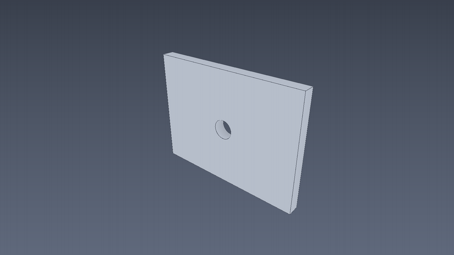
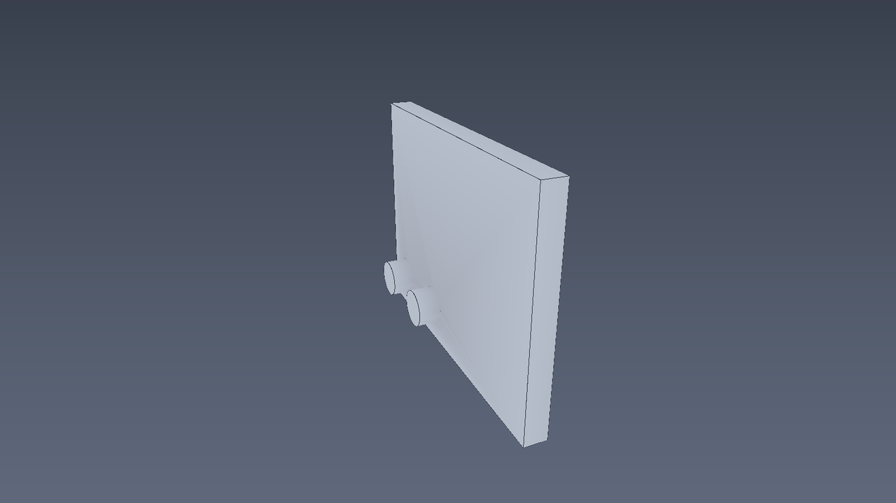
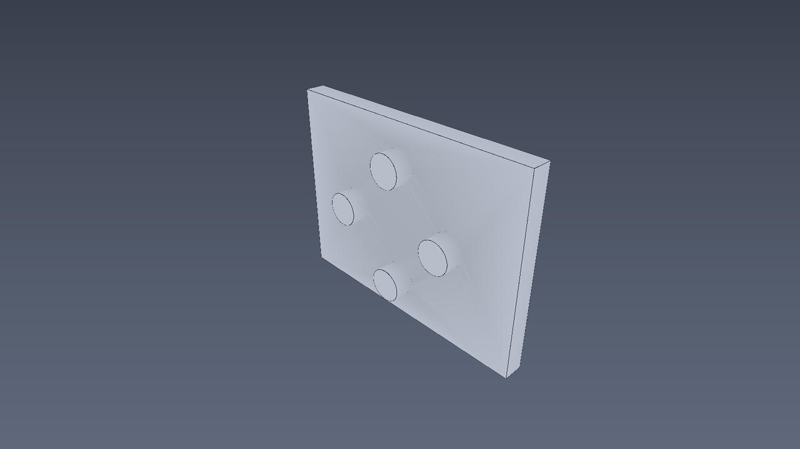
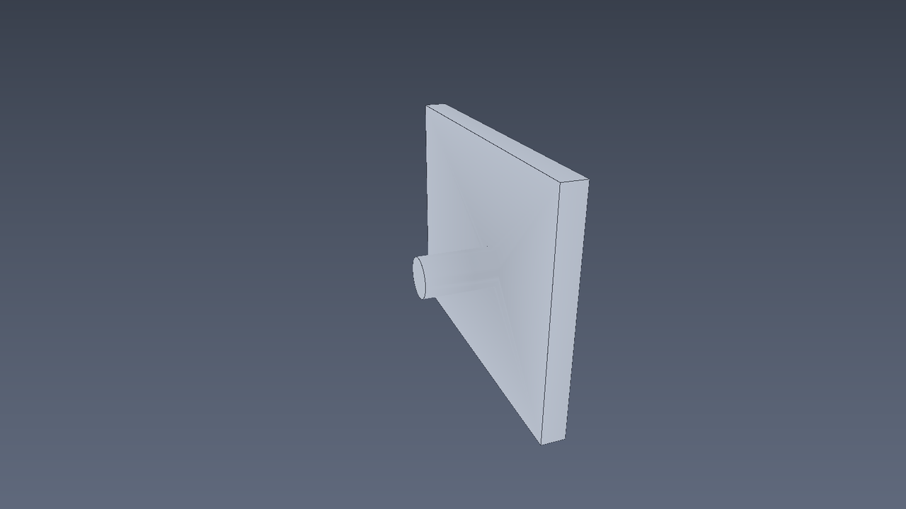

# ForgeCAD

<p align="center">
  
</p>

<p align="center">
  <sub>360° turntable of <code>examples/bracket.ocad.d</code> — OCCT solid rendered headless via wgpu (studio lighting, feature edges, baked ambient occlusion, <code>opencad turntable</code>)</sub>
</p>

<p align="center">
  
</p>

<p align="center">
  <sub>Parametric patch — <code>width 80 mm → 100 mm</code> regenerated from <code>examples/agent/width_patch.json</code></sub>
</p>

<p align="center">
  
</p>

<p align="center">
  <sub><code>examples/bracket_pin_row.ocad.d</code> — linear union pattern with <code>spacing_expr: hole_pitch</code></sub>
</p>

<p align="center">
  
</p>

<p align="center">
  <sub><code>examples/bracket_pin_ring.ocad.d</code> — circular union pattern: 4 bosses revolved around the plate centre</sub>
</p>

<p align="center">
  
</p>

<p align="center">
  <sub><code>examples/bracket_pin_mirror.ocad.d</code> — mirror pattern with <code>plane_face_ref</code> + <code>target_feature</code></sub>
</p>


AI-native, open-source, parametric 3D CAD engine.

ForgeCAD treats the **Design Graph** as the source of truth — not the GUI and not a cached B-Rep shape. Human operators, AI agents, and CI pipelines all work against the same deterministic, Git-friendly design data.

> **Note:** The CLI binary and Rust crates still use the `opencad` prefix (`opencad agent`, `opencad-cli`, etc.) while the project is branded ForgeCAD.

**Repository:** [github.com/rsasaki0109/ForgeCAD](https://github.com/rsasaki0109/ForgeCAD)

## Vision

- Operate like SOLIDWORKS for humans
- Editable by AI agents via semantic patches
- Testable, reviewable design data in `.ocad` format

## Current capabilities

| Area | Status |
|---|---|
| Parametric sketches | Distance, radius, horizontal/vertical constraints |
| Features | Extrude, hole, fillet, chamfer |
| Patterns | Linear, circular, mirror (`union` / `cut`, `spacing_expr`) |
| TopoRef | Semantic face refs, `plane_face_ref` / hole `face_ref`, fingerprint fallback |
| Agent API | JSON-RPC over stdio (`opencad agent`) — patch, query, diff, regen, pick |
| Kernel | OCCT 8.0 via cadrum (auto-download on first build) |
| Headless | CLI regen, mesh render, PNG screenshot, 360° turntable frames, STL export, golden regression tests |

## Stack

| Layer | Technology |
|---|---|
| Core | Rust |
| Geometry kernel | OpenCASCADE 8.0 (static via cadrum) |
| Desktop UI | Tauri + Web |
| Rendering | wgpu |
| Scripting | Python (plugins) |

## OCCT (no apt required)

First build downloads a prebuilt OCCT binary automatically:

```bash
cargo build -p opencad-kernel-occt
cargo test -p opencad-kernel-occt
```

Optional system install: see [docs/developer-guide/occt-install.md](docs/developer-guide/occt-install.md).

## Quick start

```bash
cargo test --workspace
cargo run -p opencad-cli -- --help

# Sample documents (also in examples/)
cargo run -p opencad-cli -- new examples/bracket.ocad.d
cargo run -p opencad-cli -- new examples/bracket_hole_row.ocad.d hole-row
cargo run -p opencad-cli -- new examples/bracket_hole_ring.ocad.d hole-ring
cargo run -p opencad-cli -- new examples/bracket_pin_row.ocad.d pin-row
cargo run -p opencad-cli -- new examples/bracket_pin_ring.ocad.d pin-ring
cargo run -p opencad-cli -- new examples/bracket_pin_mirror.ocad.d pin-mirror
cargo run -p opencad-cli -- regen examples/bracket.ocad.d

# Headless previews: a PNG screenshot or a 360° turntable PNG sequence
cargo run -p opencad-cli -- screenshot examples/bracket.ocad.d preview.png
cargo run -p opencad-cli -- turntable examples/bracket.ocad.d frames/ --frames 48
# Regenerate the README orbit/patch GIFs (needs ffmpeg): docs/assets/generate.sh

# Agent API (JSON-RPC on stdio)
echo '{"jsonrpc":"2.0","id":1,"method":"opencad.inspect","params":{"path":"examples/bracket.ocad.d"}}' \
  | opencad agent
```

## Examples

| Path | Description |
|---|---|
| `examples/bracket.ocad.d` | Bracket plate with centered mounting hole (`face_ref`) |
| `examples/bracket_hole_row.ocad.d` | Linear cut pattern with `spacing_expr: hole_pitch` |
| `examples/bracket_hole_ring.ocad.d` | Circular cut pattern (`hole-ring`) |
| `examples/bracket_pin_row.ocad.d` | Linear union pattern fused onto plate (`pin-row`) |
| `examples/bracket_pin_ring.ocad.d` | Circular union pattern fused onto plate (`pin-ring`) |
| `examples/bracket_pin_mirror.ocad.d` | Mirror pattern via `plane_face_ref`, fused onto plate |
| `examples/agent/` | JSON-RPC request samples for `opencad agent` |

Pattern comparison: [docs/examples/patterns.md](docs/examples/patterns.md).

Regenerate and export:

```bash
cargo run -p opencad-cli -- regen examples/bracket_hole_row.ocad.d
cargo run -p opencad-cli -- export examples/bracket.ocad.d bracket.stl
```

## Agent API

See [docs/api/agent.md](docs/api/agent.md) and `examples/agent/` for JSON-RPC request samples (`patch`, `query`, `diff`, `regen`, `pick`, `assign_face_ref`).

## Repository layout

```
modules/     Rust crates (core, graph, sketch, feature, …)
apps/        Desktop shell (`apps/desktop` — Tauri + Web UI)
schemas/     .ocad JSON schemas
docs/        Architecture, ADRs, API reference
examples/    Parametric model examples
tests/       Integration and regression tests
```

## Documentation

- [Architecture overview](docs/architecture/overview.md)
- [Developer guide](docs/developer-guide/index.md)
- [AGENTS.md](AGENTS.md) — rules for AI agents working in this repo

## License

MIT OR Apache-2.0
