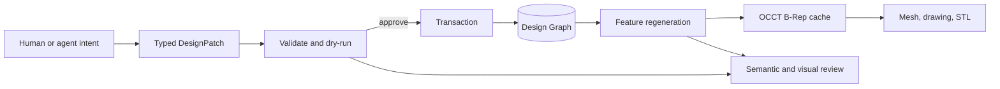

<p align="center">
  
</p>

<h1 align="center">MusubiCAD</h1>

<p align="center">
  <strong>CAD changes you can review like code.</strong>
</p>

<p align="center">
  An AI-native, open-source parametric 3D CAD system built on a deterministic Design Graph.
  Agents propose typed patches, MusubiCAD regenerates and verifies the geometry, and humans
  decide whether to apply the change.
</p>

<p align="center">
  <a href="#60-second-tour-no-build"><strong>60-second tour</strong></a>
  ·
  <a href="docs/architecture/overview.md">Architecture</a>
  ·
  <a href="docs/api/agent.md">Agent API</a>
  ·
  <a href="docs/api/plugin-api.md">Plugin API</a>
  ·
  <a href="docs/plans/roadmap.md">Roadmap</a>
</p>

<p align="center">
  <a href="https://github.com/rsasaki0109/MusubiCAD/actions/workflows/ci.yml"></a>
  <a href="https://github.com/rsasaki0109/MusubiCAD/actions/workflows/design-review.yml"></a>
  <a href="https://github.com/rsasaki0109/MusubiCAD/releases/latest"></a>
  
  
</p>

<p align="center">
  
  <br>
  <sub>A real DesignPatch raises the actuator bearing tower from 32 mm to 42 mm: source, transactional dry-run, regenerated result, semantic diff, and 2/2 passing checks—without mutating the document.</sub>
</p>

<table>
  <tr>
    <td width="50%" align="center">
      
      <br>
      <sub><strong>Feature Graph assembly</strong><br>Hubs, bores, fasteners, ribs, and mirrored mounts regenerate in dependency order.</sub>
    </td>
    <td width="50%" align="center">
      
      <br>
      <sub><strong>360° mechanical inspection</strong><br>The 2,444-triangle regenerated housing from every side.</sub>
    </td>
  </tr>
  <tr>
    <td width="50%" align="center">
      
      <br>
      <sub><strong>One Design Graph, multiple views</strong><br>The 3D model and its model-driven drawing regenerate together.</sub>
    </td>
    <td width="50%" align="center">
      
      <br>
      <sub><strong>Assembly-aware geometry</strong><br>Placed components, feature edges, connectors, and mates.</sub>
    </td>
  </tr>
  <tr>
    <td width="50%" align="center">
      
      <br>
      <sub><strong>Articulated robot arm assembly</strong><br>Four parametric parts, six connectors, and three concentric joints from one Design Graph.</sub>
    </td>
    <td width="50%" align="center">
      
      <br>
      <sub><strong>Headless rendering</strong><br>Regenerate and render the whole assembly through the CLI.</sub>
    </td>
  </tr>
</table>

## Why MusubiCAD?

| Typical binary CAD workflow | MusubiCAD workflow |
|---|---|
| Review an opaque file or screenshot | Review intent, parameters, geometry, and engineering effects |
| Automation mutates application state | Agents submit serializable `DesignPatch` proposals |
| Cached geometry can become implicit state | The deterministic Design Graph is the source of truth |
| Diffs stop at file-level changes | Semantic diff reports `bearing tower: 32 mm → 42 mm` |

The workflow is always: **agent proposes** a typed `DesignPatch` → **MusubiCAD verifies** it with a
transactional dry-run and expected-effect checks → **a human approves** the before/after diff.
AI changes never bypass validation, and a failed regeneration never corrupts the document.

## 60-second tour (no build)

See the complete review locally before installing Rust or compiling OCCT:

```bash
git clone --depth 1 https://github.com/rsasaki0109/MusubiCAD.git && cd MusubiCAD && ./quickstart.sh
```

On Windows PowerShell, use `./quickstart.ps1`. This opens the generated `32 mm → 42 mm` report
shown above. It runs no downloaded executable, makes no network request after cloning, and does
not mutate the model.

Prefer a binary? The [latest release](https://github.com/rsasaki0109/MusubiCAD/releases/latest)
ships CLI archives for Linux x86-64, Windows x86-64, and macOS (Apple Silicon and Intel). Verify
against the attached `SHA256SUMS`; archives are not yet code-signed, and warnings are documented in
[`QUICKSTART.md`](docs/release-quickstart.md).

## Run a real design review

You need [stable Rust](https://www.rust-lang.org/tools/install). The first build downloads a
prebuilt OpenCASCADE 8.0 binary automatically; no system OCCT install is required.

```bash
cargo run -p opencad-cli -- review \
  examples/robot_joint_actuator.ocad.d \
  examples/agent/review_robot_joint_patch.json \
  --output review
```

Open `review/review.html` to inspect the hub height (**32 mm → 42 mm**), mass
(**608.49 g → 653.32 g**), regenerated before/after geometry, the patch intent, and two checked
expected effects. The source document is unchanged.

The same pipeline works on assemblies—the [robot-arm review](docs/assets/arm-review/review.html)
reposes elbow and wrist joints from -45° to -75° and checks the result stays interference-free.
The [Design Review workflow](.github/workflows/design-review.yml) dogfoods these examples in CI,
regenerating the README bundle (`./docs/assets/generate-review-demo.sh`) and failing on drift.

## Design with an AI agent (MCP)

`opencad mcp` is a [Model Context Protocol](docs/api/mcp.md) server, so agent hosts such as
Claude Code can create, dry-run, review, and apply designs directly:

```bash
claude mcp add musubicad -- opencad mcp
```

Agents author new parts, assemblies, and drawings from empty documents with structural
`DesignPatch` operations, such as `add_sketch`, `add_feature`, and `add_instance`, and repair
their patches from dry-run errors that name every broken reference. Every change still passes
the same validation, review, and transaction path as a hand-written patch. See the
[authoring guide](docs/api/mcp-authoring-guide.md) and a complete
[plate-from-scratch patch](examples/agent/author_plate_from_empty_patch.json).

## How it works


```mermaid
flowchart LR
    A[Human or agent intent] --> B[Typed DesignPatch]
    B --> C[Validate and dry-run]
    C -->|approve| D[Transaction]
    D --> E[(Design Graph)]
    E --> F[Feature regeneration]
    F --> G[OCCT B-Rep cache]
    G --> H[Mesh, drawing, STL]
    C --> I[Semantic and visual review]
    F --> I
```

The module boundaries are deliberate: `modules/graph` owns design intent and dependency analysis
but no kernel calls; `modules/feature` executes only through the kernel-neutral `GeometryKernel`;
`modules/kernel-occt` holds all concrete OCCT integration; `modules/ai` never mutates outside
transactions; `modules/render` consumes disposable tessellation. See the
[architecture overview](docs/architecture/overview.md) and
[Design Graph documentation](docs/architecture/design-graph.md).

## What works today

- **Parametric modeling:** constrained sketches, extrude, hole, revolve, fillet, chamfer
- **Patterns:** linear, circular, and mirror patterns with union and cut operations
- **Semantic topology:** stable face references with fingerprint fallback across regeneration
- **Assemblies and drawings:** instances, connectors, mates, orthographic SVG, hidden lines, model-driven dimensions
- **Agent API:** JSON-RPC query, explain, patch, diff, dry-run, regenerate, pick, export
- **Structural authoring:** create and remove parameters, sketches, features, references,
  assembly components/instances/mates, and drawing sheets/views/dimensions through `DesignPatch`
- **MCP server:** `opencad mcp` exposes inspection, authoring, dry-run, review, and apply to agent hosts
- **Git-native review:** deterministic JSON/HTML/GIF artifacts, policy checks, patch rebase, three-way semantic merge
- **Headless output:** PNG/GIF rendering plus STL and SVG export

Every desktop UI command is also available through the CLI or Agent API. See the
[Agent API reference](docs/api/agent.md) and
[Git-native workflow](docs/architecture/git-native-workflow.md).

The Tauri desktop shell (`cd apps/desktop/src-tauri && cargo tauri dev`) opens `.ocad.d` documents,
regenerates previews, edits parameters, undoes and redoes, picks faces, and renders an interactive
wgpu viewport. See the [desktop guide](apps/desktop/README.md).

## Examples

| Example | Demonstrates |
|---|---|
| [`robot_arm_assembly.ocad.d`](examples/robot_arm_assembly.ocad.d) | Four-part articulated arm, six connectors, three concentric joints |
| [`robot_joint_actuator.ocad.d`](examples/robot_joint_actuator.ocad.d) | 22-feature housing: stepped hubs, bearing seats, 8-hole PCD, ribs, mirrored mounts |
| [`bearing_carrier.ocad.d`](examples/bearing_carrier.ocad.d) | Joined hub, through bore, four-hole circular cut pattern |
| [`bracket.ocad.d`](examples/bracket.ocad.d) | Plate, centered hole, and semantic face reference |
| [`bracket_front_view.ocad.d`](examples/bracket_front_view.ocad.d) | Orthographic drawing with an explicit 80 mm dimension |
| [`sketch_constraints_regression.ocad.d`](examples/sketch_constraints_regression.ocad.d) | Deterministic Equal/Parallel/Perpendicular solver regressions |
| [`examples/agent/`](examples/agent) | Ready-to-run JSON-RPC and DesignPatch requests |
| [`examples/plugin-example/`](examples/plugin-example) | Versioned linked-plugin manifest and unit-bearing feature request |

The full list—including drawings, revolves, and pattern variants—is in
[`examples/README.md`](examples/README.md).

## Project status

MusubiCAD is an early-stage engineering project, not yet a production CAD replacement. The Design
Graph, `.ocad` format, geometry pipeline, and Agent API are functional and covered by deterministic
tests, but APIs and schemas may evolve before 1.0. Dynamic plugin loading is not claimed.

Next priorities, per the [roadmap](docs/plans/roadmap.md) and
[implementation status](docs/plans/implementation-status.md):

1. Downloadable desktop builds (Phase 1)
2. Unify backend transactions, DesignPatch, and undo/redo (Phase 3)
3. Reference-focused geometry and end-to-end golden coverage (Phase 5)

## Contributing

Contributions are welcome in geometry, constraints, rendering, file formats, agent workflows,
documentation, and test fixtures. Start with [`CONTRIBUTING.md`](CONTRIBUTING.md), browse
[`good first issue`](https://github.com/rsasaki0109/MusubiCAD/labels/good%20first%20issue), and read
[`AGENTS.md`](AGENTS.md) before changing code.

## Repository layout

```text
modules/     Rust crates: core, graph, geometry, feature, AI, rendering, file, CLI
apps/        Tauri desktop shell and web UI
schemas/     Deterministic .ocad JSON schemas
docs/        Architecture, ADRs, API references, roadmap, and developer guides
examples/    Parametric documents and Agent API requests
```

> **Developer note:** Public Rust crates and the CLI retain the historical `opencad` prefix
> (`opencad-cli`, `opencad agent`) while the project is branded MusubiCAD.

## License

Licensed under either of Apache License 2.0 or the MIT License.
