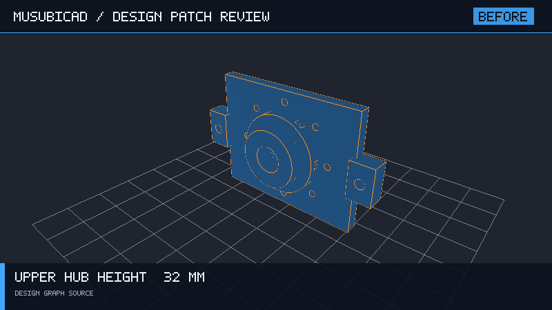
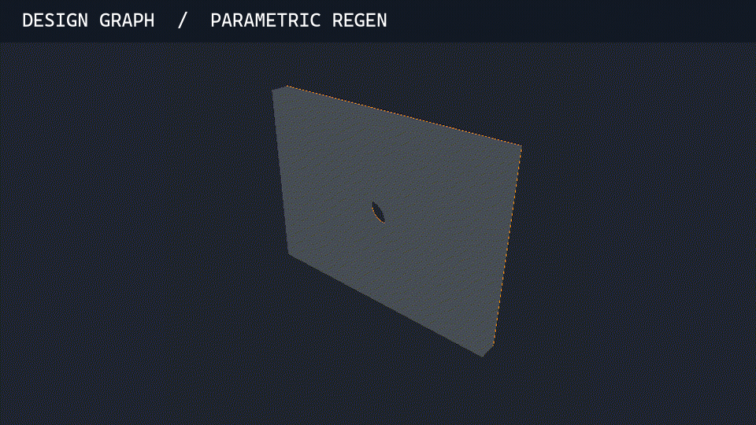
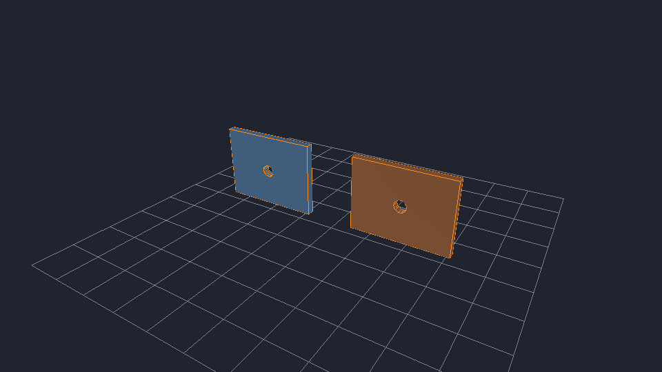
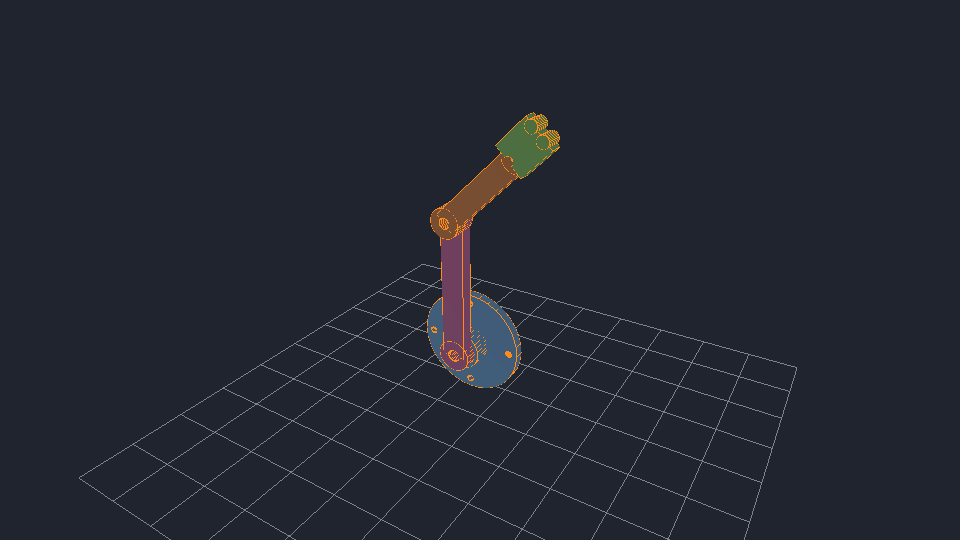
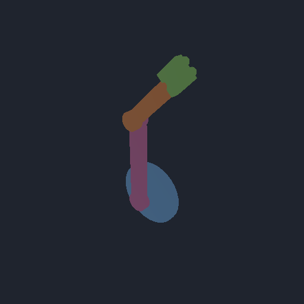
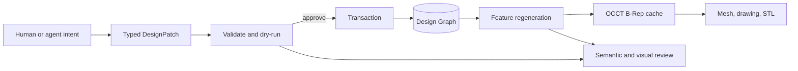

<p align="center">
  
</p>

<h1 align="center">MusubiCAD</h1>

<p align="center">
  <strong>CAD changes you can review like code.</strong>
</p>

<p align="center">
  MusubiCAD is an AI-native, open-source parametric 3D CAD system built on a
  deterministic Design Graph. Agents propose typed patches, MusubiCAD regenerates
  and verifies the geometry, and humans decide whether to apply the change.
</p>

<p align="center">
  <a href="#60-second-tour-no-build"><strong>Take the 60-second tour</strong></a>
  ·
  <a href="docs/architecture/overview.md">Architecture</a>
  ·
  <a href="docs/api/agent.md">Agent API</a>
  ·
  <a href="docs/api/plugin-api.md">Plugin API</a>
  ·
  <a href="docs/plans/roadmap.md">Roadmap</a>
</p>

<p align="center">
  <a href="https://github.com/rsasaki0109/MusubiCAD/actions/workflows/ci.yml"></a>
  <a href="https://github.com/rsasaki0109/MusubiCAD/actions/workflows/design-review.yml"></a>
  <a href="https://github.com/rsasaki0109/MusubiCAD/releases/latest"></a>
  <a href="https://github.com/rsasaki0109/MusubiCAD/stargazers"></a>
  
  
</p>

<p align="center">
  
</p>

<p align="center">
  <sub>
    A real DesignPatch increases the actuator bearing tower from 32 mm to 42 mm.
    The generated review walks through the 22-feature source, transactional dry-run, regenerated result, semantic parameter and mass diff, and 2/2 passing engineering checks—without mutating the original document.
  </sub>
</p>

<table>
  <tr>
    <td width="50%" align="center">
      
      <br>
      <sub><strong>Feature Graph assembly</strong><br>Watch hubs, bores, fasteners, ribs, and mirrored mounts regenerate in dependency order.</sub>
    </td>
    <td width="50%" align="center">
      
      <br>
      <sub><strong>360° mechanical inspection</strong><br>Inspect the 2,444-triangle regenerated housing from every side.</sub>
    </td>
  </tr>
  <tr>
    <td width="50%" align="center">
      
      <br>
      <sub><strong>One Design Graph, multiple views</strong><br>Regenerate the 3D model and its model-driven drawing together.</sub>
    </td>
    <td width="50%" align="center">
      
      <br>
      <sub><strong>Assembly-aware geometry</strong><br>Inspect placed components, feature edges, connectors, and mates.</sub>
    </td>
  </tr>
<tr>
    <td width="50%" align="center">
      
      <br>
      <sub><strong>Articulated robot arm assembly</strong><br>Four parametric parts, six connectors, and three concentric joints regenerated together from one Design Graph.</sub>
    </td>
    <td width="50%" align="center">
      
      <br>
      <sub><strong>Assembly-aware rendering</strong><br>Regenerate and render the whole assembly headlessly through the CLI.</sub>
    </td>
  </tr>
</table>

## The workflow

| 1. Agent proposes | 2. MusubiCAD verifies | 3. Human approves |
|---|---|---|
| Typed `DesignPatch` | Transactional dry-run | Before/after geometry |
| Intent and rationale | OCCT regeneration | Semantic diff |
| Explicit units | Expected-effect checks | Apply or reject |

AI changes never bypass validation. A failed regeneration never corrupts the document,
and cached B-Rep shapes and meshes remain disposable outputs of the Design Graph.

## Why MusubiCAD?

| Typical binary CAD workflow | MusubiCAD workflow |
|---|---|
| Review an opaque file or screenshot | Review intent, parameters, geometry, and engineering effects |
| Automation mutates application state | Agents submit serializable `DesignPatch` proposals |
| Cached geometry can become implicit state | The deterministic Design Graph is the source of truth |
| Failures may be discovered after editing | Patches can be dry-run and rejected before mutation |
| Diffs stop at file-level changes | Semantic diff reports values such as `bearing tower: 32 mm → 42 mm` |

The goal is not to let an LLM silently manufacture geometry. The goal is to give
humans and agents the same inspectable, testable model-editing protocol.

## 60-second tour (no build)

See the complete review locally before installing Rust or compiling OCCT:

```bash
git clone --depth 1 https://github.com/rsasaki0109/MusubiCAD.git && cd MusubiCAD && ./quickstart.sh
```

On Windows PowerShell:

```powershell
git clone --depth 1 https://github.com/rsasaki0109/MusubiCAD.git; cd MusubiCAD; ./quickstart.ps1
```

This opens the real, generated `32 mm → 42 mm` actuator-tower DesignPatch report already shown above. It runs no
downloaded executable, makes no network request after cloning, and does not mutate the model. The
scripts verify that the HTML, JSON, Markdown, GIF, and before/after images are all present first.

## Download the CLI

The [latest release](https://github.com/rsasaki0109/MusubiCAD/releases/latest) provides ready-to-run
CLI archives for Linux x86-64, Windows x86-64, macOS Apple Silicon, and macOS Intel. Every archive
includes the bracket document, DesignPatch, license, and a focused quick-start guide. Verify the
download against the attached `SHA256SUMS` before running it.

Release archives currently contain the historical `opencad` executable name. They are not yet
code-signed or notarized; platform security warnings are documented in the included
[`QUICKSTART.md`](docs/release-quickstart.md).

## Run a real design review

You need [stable Rust](https://www.rust-lang.org/tools/install). The first build
downloads a prebuilt OpenCASCADE 8.0 binary automatically; no system OCCT install is
required.

```bash
git clone https://github.com/rsasaki0109/MusubiCAD.git
cd MusubiCAD
cargo run -p opencad-cli -- review \
  examples/robot_joint_actuator.ocad.d \
  examples/agent/review_robot_joint_patch.json \
  --output review
```

The command produces a self-contained review bundle:

```text
review: review/review.html
document: doc:robot_joint_actuator_001
changes: 2
```

Open `review/review.html` to inspect:

- upper hub height: **32 mm → 42 mm**
- mass: **608.49 g → 653.32 g**
- regenerated before/after geometry
- the patch intent and rationale
- two checked expected effects

The source document is unchanged. The checked-in
[`review_robot_joint_patch.json`](examples/agent/review_robot_joint_patch.json) contains the
proposal, preconditions, and expected engineering effects.

The same review pipeline also works on assemblies. The pinned
[robot-arm review](docs/assets/arm-review/review.html) reposes the articulated
arm's elbow and wrist joints from -45° to -75° through two
`set_instance_placement` operations, reports the semantic placement diff and
geometry bounds, and checks that the reposed arm remains interference-free:

```bash
cargo run -p opencad-cli -- review \
  examples/robot_arm_assembly.ocad.d \
  examples/agent/review_robot_arm_patch.json \
  --output arm-review
```

The repository's [Design Review workflow](.github/workflows/design-review.yml) dogfoods this
same example on GitHub, publishes its parameter and geometry results in the job summary, and
attaches the complete HTML/GIF/JSON review bundle.

The hero GIF is generated from those same committed inputs. Rebuild the complete README review
bundle with one command:

```bash
./docs/assets/generate-review-demo.sh
```

On Windows PowerShell, run `./docs/assets/generate-review-demo.ps1`. CI regenerates the bundle,
compares reports exactly and raster output with a documented 1% normalized mean-absolute-error
tolerance, and fails when the demo drifts from the Design Graph, patch, or review renderer.

## How it works


```mermaid
flowchart LR
    A[Human or agent intent] --> B[Typed DesignPatch]
    B --> C[Validate and dry-run]
    C -->|approve| D[Transaction]
    D --> E[(Design Graph)]
    E --> F[Feature regeneration]
    F --> G[OCCT B-Rep cache]
    G --> H[Mesh, drawing, STL]
    C --> I[Semantic and visual review]
    F --> I
```

The boundaries are deliberate:

- `modules/graph` owns design intent and dependency analysis, not kernel calls.
- `modules/feature` executes features only through the kernel-neutral `GeometryKernel`.
- `modules/kernel-occt` contains concrete OCCT integration.
- `modules/ai` orchestrates validated patches and never mutates outside transactions.
- `modules/plugin-api` exposes linked, versioned request/result contracts and no document or kernel ownership.
- `modules/render` consumes disposable tessellation and never owns the Design Graph.

Read the [architecture overview](docs/architecture/overview.md) and
[Design Graph documentation](docs/architecture/design-graph.md) for details.

## What works today

- **Parametric modeling:** constrained sketches, extrude, hole, revolve, fillet, and chamfer
- **Patterns:** linear, circular, and mirror patterns with union and cut operations
- **Semantic topology:** stable face references with fingerprint fallback across regeneration
- **Assemblies and drawings:** instances, connectors, mates, orthographic SVG, hidden lines, and model-driven dimensions
- **Agent API:** JSON-RPC query, explain, patch, diff, dry-run, regenerate, pick, and export operations
- **Git-native review:** deterministic JSON/HTML/GIF artifacts, policy checks, patch rebase, and three-way semantic merge
- **Headless output:** PNG/GIF rendering plus STL and SVG export

Every command exposed by the desktop UI is also available through the CLI or Agent
API. See the [Agent API reference](docs/api/agent.md) and
[Git-native workflow](docs/architecture/git-native-workflow.md).

## Desktop preview

The Tauri desktop shell can open `.ocad.d` documents, regenerate previews, edit
parameters through backend commands, undo and redo edits, pick faces and sketch
entities, and open an interactive wgpu viewport. The assembly presentation in
the opening gallery is rendered through the same scene and presentation path.

```bash
cd apps/desktop/src-tauri
cargo install tauri-cli --version "^2.0.0"
cargo tauri dev
```

See the [desktop guide](apps/desktop/README.md) for platform prerequisites.

## Examples

| Example | Demonstrates |
|---|---|
| [`robot_arm_assembly.ocad.d`](examples/robot_arm_assembly.ocad.d) | Four-part articulated arm: bolted base, upper link, forearm link, and gripper; six connectors and three concentric joints |
| [`robot_arm_assembly_drawing.ocad.d`](examples/robot_arm_assembly_drawing.ocad.d) | Model-driven A4 front view of the posed arm with a 160 mm reach dimension |
| [`robot_joint_actuator.ocad.d`](examples/robot_joint_actuator.ocad.d) | Twenty-two-feature actuator housing: stepped hubs, bearing seats, 8-hole PCD, 6 ribs, and mirrored mounts |
| [`bearing_carrier.ocad.d`](examples/bearing_carrier.ocad.d) | Nine-feature bearing carrier: joined hub, through bore, and four-hole circular cut pattern |
| [`bracket.ocad.d`](examples/bracket.ocad.d) | Plate, centered hole, and semantic face reference |
| [`bracket_hole_row.ocad.d`](examples/bracket_hole_row.ocad.d) | Parametric linear cut pattern |
| [`bracket_pin_mirror.ocad.d`](examples/bracket_pin_mirror.ocad.d) | Mirror pattern driven by a semantic plane reference |
| [`revolve_bushing.ocad.d`](examples/revolve_bushing.ocad.d) | Revolved annular solid |
| [`assembly_two_brackets.ocad.d`](examples/assembly_two_brackets.ocad.d) | Components, placements, connectors, and mates |
| [`bracket_front_view.ocad.d`](examples/bracket_front_view.ocad.d) | Orthographic drawing with an explicit 80 mm dimension |
| [`sketch_constraints_regression.ocad.d`](examples/sketch_constraints_regression.ocad.d) | Deterministic Equal/Parallel/Perpendicular solver regression cases |
| [`examples/agent/`](examples/agent) | Ready-to-run JSON-RPC and DesignPatch requests |
| [`examples/plugin-example/`](examples/plugin-example) | Versioned linked-plugin manifest and unit-bearing feature request |

More examples and commands are listed in [`examples/README.md`](examples/README.md).

## Project status

MusubiCAD is an early-stage engineering project, not yet a production CAD replacement.
The Design Graph, `.ocad` format, geometry pipeline, and Agent API are functional and
covered by deterministic tests, but APIs and schemas may evolve before 1.0.

The canonical [development roadmap](docs/plans/roadmap.md) and
[implementation status](docs/plans/implementation-status.md) distinguish shipped
capabilities from planned work. The next active priorities are:

1. Downloadable desktop builds (Phase 1)
2. Unify backend transactions, DesignPatch, and undo/redo (Phase 3)
3. Reference-focused geometry and end-to-end golden coverage (Phase 5)

Assembly and Drawing are implemented milestones; their remaining quality work is
tracked in Phase 5. The linked Plugin API, deterministic registry, and CLI/Agent
invocation paths are implemented in Phase 4; dynamic loading is not claimed.

Recently delivered: deterministic solver diagnostics and sketch regression fixtures
(DOF, rank-based redundancy, contradiction, unit conversion, and canonical
round-trips), GitHub-native review summaries, reproducible README demos, and a
zero-build 60-second tour.

## Contributing

Contributions are welcome in geometry, constraints, rendering, file formats, agent
workflows, documentation, and test fixtures. Start with the focused
[`CONTRIBUTING.md`](CONTRIBUTING.md), browse
[`good first issue`](https://github.com/rsasaki0109/MusubiCAD/labels/good%20first%20issue), and read
[`AGENTS.md`](AGENTS.md) before changing code.

If reviewable, agent-safe CAD sounds useful, star the repository or open an issue with
the workflow you want MusubiCAD to support next.

## Repository layout

```text
modules/     Rust crates: core, graph, geometry, feature, AI, rendering, file, CLI
apps/        Tauri desktop shell and web UI
schemas/     Deterministic .ocad JSON schemas
docs/        Architecture, ADRs, API references, and developer guides
             plus the canonical roadmap and implementation inventory
examples/    Parametric documents and Agent API requests
```

> **Developer note:** Public Rust crates and the CLI currently retain the historical
> `opencad` prefix (`opencad-cli`, `opencad agent`) while the project is branded
> MusubiCAD.

## License

Licensed under either of:

- Apache License, Version 2.0
- MIT License
