<p align="center">
  
</p>

<h1 align="center">MusubiCAD</h1>

<p align="center">
  <strong>Let your agent iterate on real CAD — every change verified.</strong>
</p>

<p align="center">
  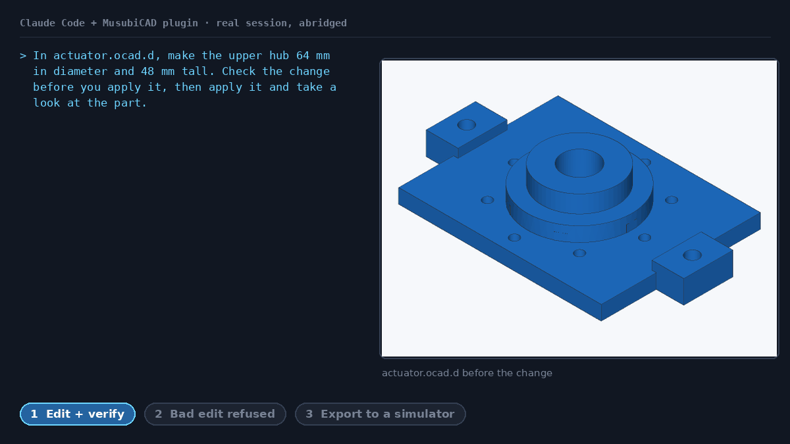
  <br>
  <sub>Abridged from a real Claude Code session with this plugin (<a href="docs/assets/agent-demo/hero-session.json">transcript</a>).
  Every shape is a real regeneration, the preview is the exact PNG the agent looked at, and the arm is the URDF it exported, loaded in MuJoCo.</sub>
</p>

<p align="center">
  A parametric CAD plugin for coding agents such as Claude Code. Your agent edits named,
  unit-bearing parameters in a Design Graph; MusubiCAD dry-runs every change, rebuilds the solid
  with OpenCASCADE, checks it against what the agent said it would do, and only then writes the
  file. Export STEP, 3MF, STL, GLB, drawings, and URDF for robot simulators.
</p>

<p align="center">
  <a href="#install"><strong>Install</strong></a>
  ·
  <a href="docs/assets/agent-demo/hero-session.json">Full session transcript</a>
  ·
  <a href="docs/api/mcp.md">MCP tools</a>
  ·
  <a href="docs/architecture/overview.md">Architecture</a>
  ·
  <a href="docs/plans/roadmap.md">Roadmap</a>
</p>

<p align="center">
  <a href="https://github.com/rsasaki0109/MusubiCAD/actions/workflows/ci.yml"></a>
  <a href="https://github.com/rsasaki0109/MusubiCAD/actions/workflows/design-review.yml"></a>
  <a href="https://github.com/rsasaki0109/MusubiCAD/releases/latest"></a>
  
  
</p>

## Install

1. Install the `musubicad` binary (one self-contained executable with OpenCASCADE linked in,
   checksum-verified, no build):

   ```bash
   curl -fsSL https://raw.githubusercontent.com/rsasaki0109/MusubiCAD/main/install.sh | sh
   ```

   Windows PowerShell (installer tested; agent hosts on Windows not yet verified):
   `irm https://raw.githubusercontent.com/rsasaki0109/MusubiCAD/main/install.ps1 | iex`

2. Add the plugin (MCP server plus the `musubicad` skill) to Claude Code:

   ```bash
   claude plugin marketplace add rsasaki0109/MusubiCAD
   claude plugin install musubicad@musubicad
   ```

   Any other MCP host: run the stdio server `musubicad mcp`. Codex, Cursor, and Gemini CLI
   manifests are included but not yet tested on those hosts.

Then ask for a part: *"Design a 60 × 40 × 5 mm mounting plate with a 10 mm hole and export it
as STEP"*, or point the agent at one of the [examples](examples/README.md).

## What your agent gets

- **Parameters, not code.** Dimensions are named and carry units (`bore_diameter = 8 mm`). The
  next request is one `set_parameter`, not a rewrite.
- **A verified change, every time.** `patch_dry_run` rebuilds the model before and after and
  reports the semantic diff, the mass and size change, interference counts, and whether the
  patch's declared expected effects hold. `patch_apply` refuses anything that fails and leaves
  the file unchanged. The error names the feature that broke.
- **Eyes on the part.** `preview_document` returns a PNG the agent can look at (iso, front, top,
  or right view) with the bounds in millimetres. It renders on the CPU, so it works in cloud
  containers and CI without a GPU.
- **Reviewable diffs.** `review_patch` writes an HTML before/after review with the semantic diff
  and checks (and images when a GPU is available) for a human to approve.
- **Real outputs.** STEP (millimetre B-rep) for CAD/CAM, 3MF and STL for slicers, GLB for
  viewers and the web, SVG drawings, and URDF for robot simulators.
- **Authoring from scratch.** Parameters, constrained sketches, features (extrude, hole,
  revolve, fillet, chamfer, shell, patterns, mirror, loft, sweep, helix), assemblies with
  mates and robot joints, and drawings, all as typed `DesignPatch` operations.

## One parameter, every frame regenerated

```bash
musubicad animate-sweep examples/robot_joint_actuator.ocad.d hub.gif \
  --param upper_hub_height --from 32mm --to 64mm --steps 14
```

<p align="center">
  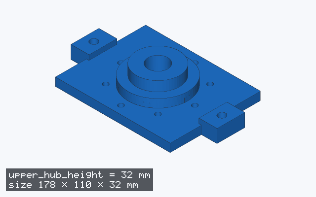
</p>

Each frame is the part rebuilt by OpenCASCADE at that value, through the same validated
`set_parameter` patch an agent sends. A value the part cannot survive stops the sweep and names
itself; the file on disk never changes.

## Why edits don't break

The Design Graph is the source of truth, and the geometry is rebuilt from it on every check. On
the bearing carrier example, a valid-looking edit of `bore_diameter` from 18 mm to 200 mm used
to pass validation; now the dry-run reports:

```text
patched document does not regenerate: feature 'feature:bearing_bore': OCCT error: Expected exactly one resulting Solid, got 0
```

and `patch_apply` refuses it. A patch that rebuilds fine but misses its declared intent, for
example `mass_delta_kg` in `[-1, 0]` for a change that adds 7.72 g, is refused the same way. The
same gate runs on `musubicad patch` for agents that use the CLI instead of MCP. See
[ADR-026](docs/adr/ADR-026-verified-patch-apply.md).

<p align="center">
  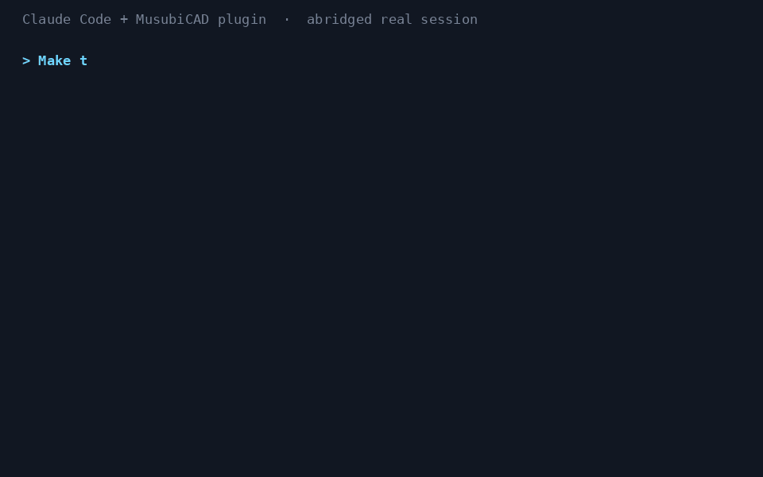
  <br>
  <sub>An earlier session on the bearing carrier (<a href="docs/assets/agent-demo/session.json">transcript</a>):
  the 200 mm bore is refused because the part no longer regenerates, and the file stays at 8 mm.</sub>
</p>

## From CAD to simulator: URDF

Move the arm through its declared joints before it leaves MusubiCAD (CPU only, no GPU):

```bash
musubicad animate-joints examples/robot_arm_assembly.ocad.d arm.gif \
  --pose shoulder=70deg,elbow=-80deg,wrist=45deg \
  --pose shoulder=-60deg,elbow=110deg,wrist=-60deg \
  --pose shoulder=20deg,elbow=40deg,wrist=80deg
```

<p align="center">
  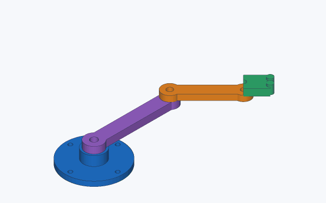
</p>

A pose past a joint limit is refused before anything renders. Then export the same tree for a
simulator:

```bash
musubicad export examples/robot_arm_assembly.ocad.d urdf/robot_arm.urdf
```

<p align="center">
  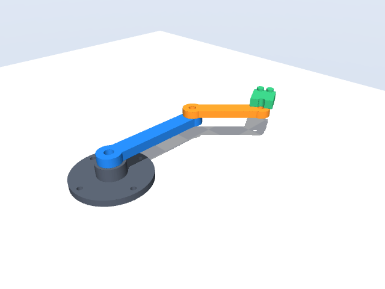
</p>

The grounded base becomes the root link, and the three concentric mates become revolute joints
about their axes, with the limits, effort, and velocity declared in the design (shoulder ±150°,
elbow −100° to 140°, wrist ±90°). Each part is exported as an STL, and masses and inertia
tensors come from the regenerated solids. Loaded in MuJoCo 3.15, the arm has three limited
hinge joints with exactly those ranges, its link positions match the CAD placements within
1e-13 m, and with the fixed base kept as its own body (`fusestatic="false"`) its link masses
add up to the assembly's 0.7349 kg. Parts use a 2700 kg/m³ density, and joint positions come
from connector frames in the assembly. Changing a limit is one `set_joint` patch, verified like
any other change, followed by a re-export. See
[ADR-028](docs/adr/ADR-028-urdf-export.md) and [ADR-030](docs/adr/ADR-030-assembly-joints.md).

## Evidence: reviewable design changes

<p align="center">
  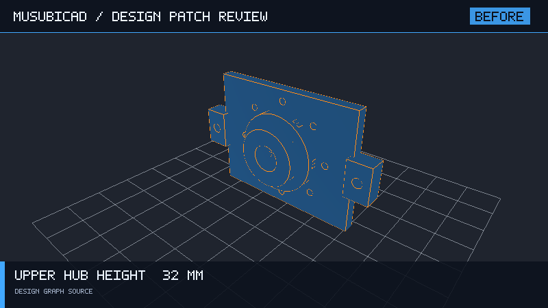
  <br>
  <sub>A real DesignPatch raises the actuator bearing tower from 32 mm to 42 mm: source, transactional dry-run, regenerated result, semantic diff, and 2/2 passing checks—without mutating the document.</sub>
</p>

<table>
  <tr>
    <td width="50%" align="center">
      
      <br>
      <sub><strong>Feature Graph assembly</strong><br>Hubs, bores, fasteners, ribs, and mirrored mounts regenerate in dependency order.</sub>
    </td>
    <td width="50%" align="center">
      
      <br>
      <sub><strong>360° mechanical inspection</strong><br>The 2,444-triangle regenerated housing from every side.</sub>
    </td>
  </tr>
  <tr>
    <td width="50%" align="center">
      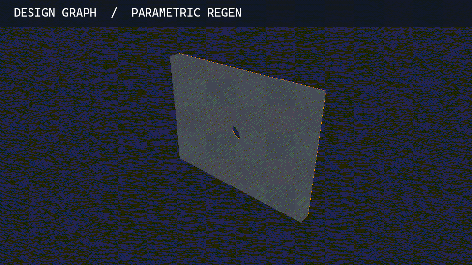
      <br>
      <sub><strong>One Design Graph, multiple views</strong><br>The 3D model and its model-driven drawing regenerate together.</sub>
    </td>
    <td width="50%" align="center">
      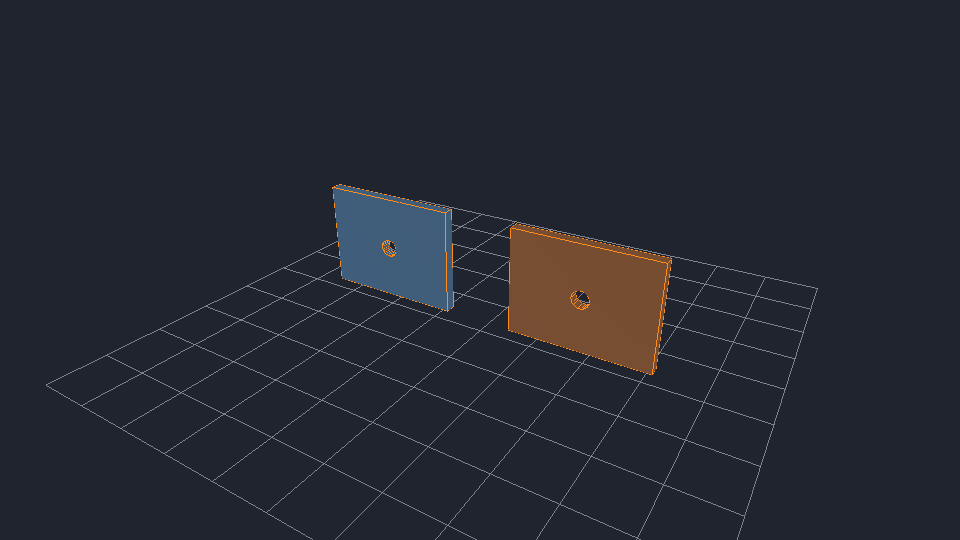
      <br>
      <sub><strong>Assembly-aware geometry</strong><br>Placed components, feature edges, connectors, and mates.</sub>
    </td>
  </tr>
  <tr>
    <td width="50%" align="center">
      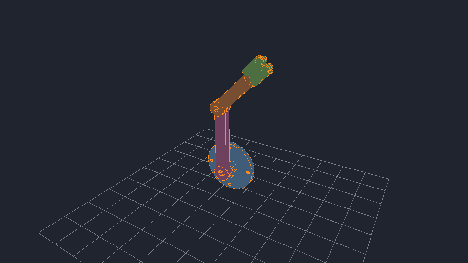
      <br>
      <sub><strong>Articulated robot arm assembly</strong><br>Four parametric parts, six connectors, and three concentric joints from one Design Graph.</sub>
    </td>
    <td width="50%" align="center">
      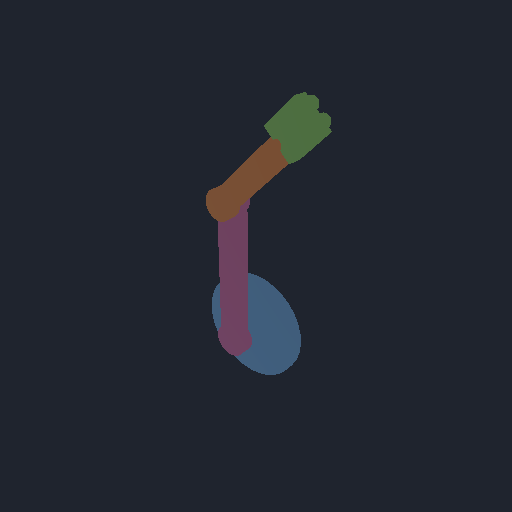
      <br>
      <sub><strong>Headless rendering</strong><br>Regenerate and render the whole assembly through the CLI.</sub>
    </td>
  </tr>
</table>

The workflow is always: **agent proposes** a typed `DesignPatch` → **MusubiCAD verifies** it with a
transactional dry-run and expected-effect checks → **a human approves** the before/after diff.

See the review locally without installing anything:

```bash
git clone --depth 1 https://github.com/rsasaki0109/MusubiCAD.git && cd MusubiCAD && ./quickstart.sh
```

On Windows PowerShell, use `./quickstart.ps1`. It opens the generated `32 mm → 42 mm` report
shown above, runs no downloaded executable, and does not mutate the model.

## Build from source

You need [stable Rust](https://www.rust-lang.org/tools/install). The first build downloads a
prebuilt OpenCASCADE 8.0 binary automatically; no system OCCT install is required.

```bash
cargo run -p opencad-cli -- review \
  examples/robot_joint_actuator.ocad.d \
  examples/agent/review_robot_joint_patch.json \
  --output review
```

Open `review/review.html` to inspect the hub height (**32 mm → 42 mm**), mass
(**609.23 g → 654.36 g**), regenerated before/after geometry, the patch intent, and two checked
expected effects. The source document is unchanged. The
[robot-arm review](docs/assets/arm-review/review.html) reposes elbow and wrist joints from -45° to
-75° and checks the result stays interference-free. The
[Design Review workflow](.github/workflows/design-review.yml) regenerates these bundles in CI and
fails on drift.

## How it works

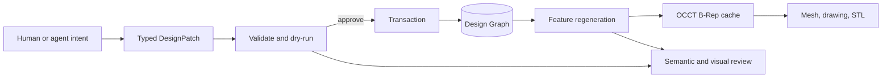
```mermaid
flowchart LR
    A[Human or agent intent] --> B[Typed DesignPatch]
    B --> C[Validate and dry-run]
    C -->|approve| D[Transaction]
    D --> E[(Design Graph)]
    E --> F[Feature regeneration]
    F --> G[OCCT B-Rep cache]
    G --> H[Mesh, drawing, STL]
    C --> I[Semantic and visual review]
    F --> I
```

The module boundaries are deliberate: `modules/graph` owns design intent and dependency analysis
but no kernel calls; `modules/feature` executes only through the kernel-neutral `GeometryKernel`;
`modules/kernel-occt` holds all concrete OCCT integration; `modules/ai` never mutates outside
transactions; `modules/render` consumes disposable tessellation. See the
[architecture overview](docs/architecture/overview.md) and
[Design Graph documentation](docs/architecture/design-graph.md).

## What works today

- **Parametric modeling:** constrained sketches, extrude, hole, revolve, fillet, chamfer
- **Patterns:** linear, circular, and mirror patterns with union and cut operations
- **Semantic topology:** stable face references with fingerprint fallback across regeneration
- **Assemblies and drawings:** instances, connectors, mates, robot joints with limits, orthographic SVG, hidden lines, model-driven dimensions
- **Agent API:** JSON-RPC query, explain, patch, diff, dry-run, regenerate, pick, export
- **Structural authoring:** create and remove parameters, sketches, features, references,
  assembly components/instances/mates, and drawing sheets/views/dimensions through `DesignPatch`
- **MCP server and agent plugin:** `musubicad mcp` exposes inspection, authoring, verified dry-run,
  review, apply, GPU-free preview images, and export; a Claude Code plugin and skill package it with a
  checksum-verified installer
- **Git-native review:** deterministic JSON/HTML/GIF artifacts, policy checks, patch rebase, three-way semantic merge
- **Headless output:** PNG/GIF rendering, CPU preview without a GPU, and STEP (millimetre B-rep),
  3MF, STL, GLB, SVG, and URDF export

Every desktop UI command is also available through the CLI or Agent API. See the
[Agent API reference](docs/api/agent.md) and
[Git-native workflow](docs/architecture/git-native-workflow.md).

The Tauri desktop shell (`cd apps/desktop/src-tauri && cargo tauri dev`) opens `.ocad.d` documents,
regenerates previews, edits parameters, undoes and redoes, picks faces, and renders an interactive
wgpu viewport. See the [desktop guide](apps/desktop/README.md).

## Examples

| Example | Demonstrates |
|---|---|
| [`robot_arm_assembly.ocad.d`](examples/robot_arm_assembly.ocad.d) | Four-part articulated arm, six connectors, three revolute joints with limits; exports to URDF |
| [`robot_joint_actuator.ocad.d`](examples/robot_joint_actuator.ocad.d) | 22-feature housing: stepped hubs, bearing seats, 8-hole PCD, ribs, mirrored mounts |
| [`bearing_carrier.ocad.d`](examples/bearing_carrier.ocad.d) | Joined hub, through bore, four-hole circular cut pattern |
| [`bracket.ocad.d`](examples/bracket.ocad.d) | Plate, centered hole, and semantic face reference |
| [`bracket_front_view.ocad.d`](examples/bracket_front_view.ocad.d) | Orthographic drawing with an explicit 80 mm dimension |
| [`sketch_constraints_regression.ocad.d`](examples/sketch_constraints_regression.ocad.d) | Deterministic Equal/Parallel/Perpendicular solver regressions |
| [`examples/agent/`](examples/agent) | Ready-to-run JSON-RPC and DesignPatch requests |
| [`examples/plugin-example/`](examples/plugin-example) | Versioned linked-plugin manifest and unit-bearing feature request |

The full list—including drawings, revolves, and pattern variants—is in
[`examples/README.md`](examples/README.md).

## Project status

MusubiCAD is an early-stage engineering project, not yet a production CAD replacement. The Design
Graph, `.ocad` format, geometry pipeline, and Agent API are functional and covered by deterministic
tests, but APIs and schemas may evolve before 1.0. Dynamic plugin loading is not claimed.

Next priorities, per the [roadmap](docs/plans/roadmap.md) and
[implementation status](docs/plans/implementation-status.md):

1. Connector frames that follow part parameters, so lengthening a link moves its joint origins,
   and joint-angle parameters for posing an assembly (Phase 8)
2. Per-part materials and densities for mass, inertia, and URDF
3. Verified installs on Windows hosts and on Codex, Cursor, and Gemini CLI

## Contributing

Contributions are welcome in geometry, constraints, rendering, file formats, agent workflows,
documentation, and test fixtures. Start with [`CONTRIBUTING.md`](CONTRIBUTING.md), browse
[`good first issue`](https://github.com/rsasaki0109/MusubiCAD/labels/good%20first%20issue), and read
[`AGENTS.md`](AGENTS.md) before changing code.

## Repository layout

```text
modules/     Rust crates: core, graph, geometry, feature, AI, rendering, file, CLI
apps/        Tauri desktop shell and web UI
schemas/     Deterministic .ocad JSON schemas
docs/        Architecture, ADRs, API references, roadmap, and developer guides
examples/    Parametric documents and Agent API requests
```

> **Developer note:** The CLI is `musubicad` (`opencad` remains as an alias in release archives).
> Rust crates and Agent API method names keep the historical `opencad` prefix (`opencad-cli`,
> `opencad.patch_apply_document`) because they are API identifiers.

## License

Licensed under either of Apache License 2.0 or the MIT License.
