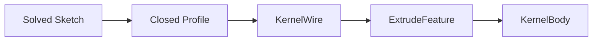

# Feature Modeling

Parametric features live in `opencad-feature` and execute through the kernel-neutral `GeometryKernel` trait.

## Pipeline



1. Sketches are solved and profiles detected in `opencad-sketch`.
2. `profile_to_solved()` converts a closed profile into `SolvedSketch`.
3. `GeometryKernel::make_wire_from_sketch()` builds a wire.
4. `ExtrudeFeature` calls `extrude()` and stores the resulting `KernelBody`.

## Core types

| Type | Role |
|---|---|
| `FeatureDefinition` | Serializable sketch / extrude payload |
| `FeatureNode` | Feature id, name, definition |
| `FeatureRegistry` | Dispatches executors by feature type |
| `PartModel` | Feature graph + sketches + regen outputs |
| `RegenContext` | Kernel + prior feature outputs |

## Regeneration

```rust
let mut model = bracket_base_plate()?;
let kernel = OcctGeometryKernel::new();
let registry = FeatureRegistry::with_defaults();
model.regenerate(&kernel, &registry)?;
```

Features run in topological order from `FeatureGraph::recompute_order()`. Suppressed features are skipped.

## Supported feature types

| type | Description |
|---|---|
| `sketch` | 2D profile source |
| `extrude` | Boss / cut / join from sketch |
| `hole` | Sketch-driven cut |
| `fillet` | Edge rounding |
| `chamfer` | Edge chamfer |
| `linear_pattern` | Translate + union/cut repeated copies of a source body |
| `circular_pattern` | Rotate + union/cut repeated copies around an axis |
| `mirror_pattern` | Mirror + union/cut a source body across a plane |

### Pattern options

- `operation`: `union` (default) or `cut`
- `target_feature`: required for `cut` — body to subtract from
- `spacing_expr`: linear pattern only — parametric spacing resolved before regen

```json
{
  "type": "linear_pattern",
  "source_feature": "feature:hole_mount",
  "target_feature": "feature:extrude_base",
  "operation": "cut",
  "direction_m": [1.0, 0.0, 0.0],
  "spacing": { "type": "distance", "length": { "m": 0.02 } },
  "spacing_expr": "hole_pitch",
  "count": 3
}
```

```json
{
  "type": "circular_pattern",
  "source_feature": "feature:boss",
  "axis_origin_m": [0.0, 0.0, 0.0],
  "axis_direction_m": [0.0, 0.0, 1.0],
  "count": 4,
  "operation": "union"
}
```

```json
{
  "type": "mirror_pattern",
  "source_feature": "feature:boss",
  "plane_origin_m": [0.04, 0.0, 0.0],
  "plane_normal_m": [1.0, 0.0, 0.0],
  "operation": "union"
}
```

## Rules

- OCCT types stay in `opencad-kernel-occt`.
- Feature code never imports `cadrum` or OCCT FFI.
- Sketches must be solved (literal point coordinates) before extrude.

## Further reading

- [Geometry kernel boundary](./geometry-kernel.md)
- [Design graph](./design-graph.md)
